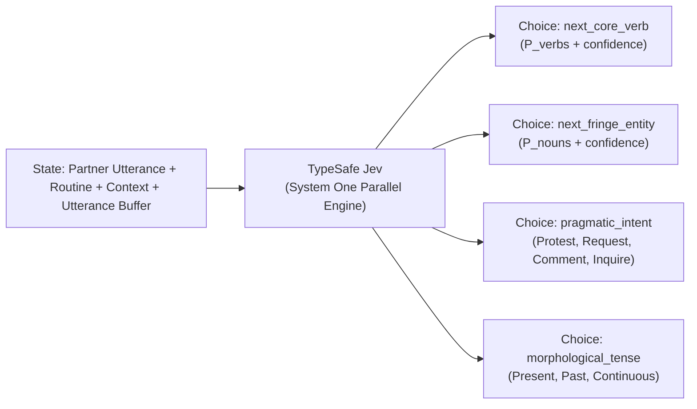
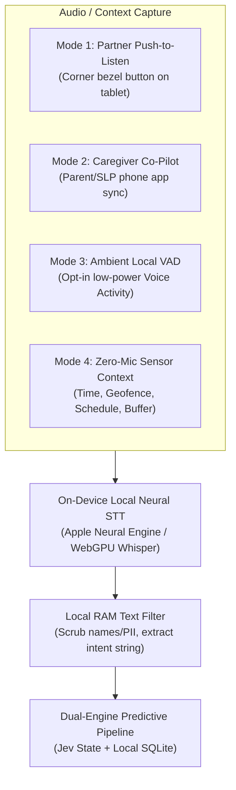

# Pip AAC — Dual-Engine Predictive Intelligence Architecture & Clinical Pedagogy

**DECIDED 2026-09-21** (founder brief intake).
Owner: `docs/strategy/Dual_Engine_Predictive_Intelligence.md`.
Foundational vision: `docs/strategy/Vision.md`.
Durable facts map: `docs/product/SSOT.md`.
Design invariants: `docs/product/Design_Invariants.md`.

---

## 1. Executive Summary: The Two Pillars of Pip AAC

Transforming Augmentative and Alternative Communication (AAC) from an obsolete, stigmatizing tool into a fluent, joyful extension of human capability requires two foundational breakthroughs working in unison:

```text
+-----------------------------------------------------------------------------------+
|                                     PIP AAC                                       |
+-----------------------------------------------------------------------------------+
|                                                                                   |
|  PILLAR 1: THE BODY                                                               |
|  The Relational Language & World Graph ("The Airtable Jump")                      |
|  - Decouples language semantics from fixed 2D button matrices                     |
|  - Invariant spatial vector anchoring preserves motor planning across densities    |
|  - Multi-surface projections: Motor Grid, Context River, Visual Scenes, Co-Pilot  |
|  - Zero-friction living fringe: entities populate relations automatically         |
|                                                                                   |
|                                         +                                         |
|                                                                                   |
|  PILLAR 2: THE NERVOUS SYSTEM                                                     |
|  Dual-Engine Predictive Intelligence (TypeSafe Jev + Local-First Memory)          |
|  - Formulates next-word prediction as fast classification, not text generation    |
|  - Cloud Edge System One (TypeSafe Jev): sub-100ms semantic probabilities         |
|  - Local-First Private Database (SQLite/IndexedDB): encrypted on-device history    |
|  - Privacy-preserving multimodal partner input: on-device neural speech capture   |
|  - Predictive strip: at most four fringe tiles; core cells never reorder         |
|  - Clinical self-advocacy: proactive refusal, protest, and authentic preference   |
|                                                                                   |
+-----------------------------------------------------------------------------------+
```

Together, these two pillars solve the single most devastating metric in assistive communication: **the communication rate chasm**. 

While verbal conversation flows at **120 to 150 words per minute**, traditional AAC communicators are trapped at **2 to 15 words per minute**. More than 70% of that time is spent visually hunting through 4-level deep folder hierarchies or fighting clunky, context-blind auto-complete bars. 

Pip AAC closes this gap without violating motor automaticity, without invasive surveillance, and without putting words in the learner's mouth.

---

## 2. Why Traditional AAC Prediction Failed

AAC prediction has historically been crippled by a false dichotomy between two flawed paradigms:

| Metric | Legacy N-Gram Tables (1990s–Present)<br>*(Proloquo, TouchChat, iOS T9)* | Generative LLMs (2023–2025)<br>*(GPT-4, Claude, Gemini)* | **Pip AAC Dual-Engine**<br>*(TypeSafe Jev + Local-First Store)* |
| :--- | :--- | :--- | :--- |
| **Model Type** | Static statistical bigrams / trigrams | Autoregressive token generation | **System One Discrete Classification + Local Memory** |
| **Context Awareness** | **Zero.** Blind to time, environment, partner speech, or routines. | High, but prone to verbose hallucinations. | **Exact.** Contextual state (routine, partner speech, preferences). |
| **Output Shape** | Flat alphabetical or frequency word lists | Free-form conversational text | **Calibrated probability distribution over candidate tiles** |
| **Latency** | Instant (0ms) but semantically useless | High (500ms–2,000ms+ token stream) | **Ultra-Fast (<100ms cloud, <1ms local fallback)** |
| **Economics** | Free (baked into offline app) | Prohibitive (\$15–\$50/month per child) | **Negligible (\$0.042/Mtok, output free; <\$0.50/yr/child)** |
| **Motor Memory** | Jumps buttons around unpredictably | Incompatible with fixed grid layouts | **Core cells stay put. Halos mark words already on the grid. A strip of at most four tiles offers words that are not.** |
| **Privacy / Safety** | Offline / Private | Requires sending student dialogue to LLM clouds | **Zero-PII. Raw logs stay 100% encrypted on device.** |

### The Core Mathematical Insight
Human speech generation in an AAC environment is **not an open-ended prose generation problem**. An AAC learner has a defined, personalized universe of words:
- ~200 core words (verbs, pronouns, spatial prepositions, negation).
- ~300 to 1,500 personal fringe entities (family members, pets, foods, games, places).
- A finite set of pragmatic communicative functions (protest, request, comment, ask).

The mathematical task is:
$$\arg\max_{w \in \mathcal{V}_{\text{candidate}}} P\bigl(w \;\big|\; \text{Context State}, \text{Partner Utterance}, \text{Learner Preferences}\bigr)$$

This is a **pure classification problem**. And TypeSafe's Jev is the first foundational model engineered specifically for low-latency, calibrated System One classification.

---

## 3. Engine 1: Cloud-Edge System One (TypeSafe Jev)

TypeSafe Jev acts as the real-time semantic classifier for Pip AAC. Rather than generating text, Jev evaluates a structured `state` against typed `Choice` questions in parallel.

### 3.1 Parallel Multi-Question Architecture
In a single API round-trip, Pip AAC evaluates four distinct linguistic dimensions across the candidate vocabulary without incurring context rot or added latency:



### 3.2 State Structure (Zero PII by Design)
The `state` payload sent to Jev is compact, structured, and entirely scrubbed of personally identifiable information:

```json
{
  "model": "jev-latest",
  "state": {
    "partner_utterance": "Do you want pancakes or waffles?",
    "active_routine": "breakfast",
    "time_of_day": "08:20",
    "utterance_buffer": ["I"],
    "learner_profile_hints": {
      "refuses": ["pancakes"],
      "breakfast_favorites": ["waffles", "strawberries"]
    }
  },
  "questions": {
    "predicted_next_word": {
      "type": "choice",
      "instructions": "Given the partner's offer and the learner's preferences, which concept does the learner intend to select next?",
      "criteria": {
        "no": "Rejection or refusal of the offered item",
        "waffles": "Selection of favored breakfast item",
        "pancakes": "Acceptance of first offered item",
        "more": "Requesting continuation",
        "want": "Core auxiliary verb continuing sentence",
        "other": "None of the above"
      }
    },
    "pragmatic_intent": {
      "type": "choice",
      "instructions": "What is the primary communicative purpose of the next utterance?",
      "criteria": {
        "protest_refusal": "Rejecting an offered item or activity",
        "choice_making": "Selecting a specific preferred item",
        "commenting": "Sharing a reaction or feeling",
        "information_request": "Asking for clarification"
      }
    }
  }
}
```

### 3.3 Calibrated Confidence as a Protective UX Valve
TypeSafe provides a mathematically calibrated `confidence` metric ($0.0$ to $1.0$) reflecting the spread of probabilities. Pip AAC uses this confidence to enforce **communicator autonomy**:

- **High Confidence ($\ge 0.75$):** If the candidate is already a core cell, it is gently highlighted with a soft halo in that **exact motor position**. If it is not on the core view, it may appear in the predictive strip (section 3.4). Visual search time drops from seconds to milliseconds. The cell itself does not move.
- **Moderate Confidence ($0.40 - 0.74$):** On the motor-grid view, an off-grid candidate may occupy the strip. On the Context River view, it is softly primed in that drawer. Core cells stay put in either case.
- **Low Confidence ($< 0.40$):** **The system does nothing.** The grid stays neutral and the strip stays empty. The system strictly obeys the clinical imperative: *Never guess or impose assumptions when the communicator's intent is uncertain.*

### 3.4 Predictive Strip: Where Dynamic Candidates Live

**DECIDED 2026-09-22** (not built). Layout owner: `docs/product/Motor_Grid_And_Art.md`.

The strip is the dynamic surface. The core grid is not.

- After a core tap, the strip's first paint comes from the on-device ranker and resolves in under 50 ms, including the choice of which tiles to show. The local preference query itself is already specified at under 0.5 ms. The 50 ms figure is the strip's user-visible budget.
- TypeSafe Jev may replace or reorder strip tiles when a cloud result arrives. It must not block the first paint, and it must not move core cells. If the network is down or slower than the existing 150 ms clamp, the strip stays on the local score ($\alpha \to 0$, $\beta \to 1$).
- The strip shows at most four candidates. Each tile is a word plus its in-house icon. Putting a word in the strip does not swap a core cell.
- High-confidence core words that already have a home on the grid are haloed in that home. They are not relocated into the strip.
- The strip is allowed to bias toward: the tokens already in the sentence bar; time of day (morning favors breakfast words; evening favors sleep and clothing words); and fringe entities the caregiver has added (names, shows, snacks). Those inputs were already part of Engine 1 state and Engine 2 memory. The strip is where fringe results become visible.
- Empty or low-confidence strip: show nothing. An empty strip is a valid state. Filling it with a guess is not.

---

## 4. Engine 2: The Local-First Private Memory Store

While Jev provides broad semantic reasoning and linguistic fluency, **personal truth lives locally on the child's device**.

### 4.1 Strict Privacy Mandate (FERPA, HIPAA, COPPA)
Student communication logs, personal diaries, behavioral reactions, and daily patterns must **never** be stored on an unencrypted cloud server or used to train third-party models. 

Pip AAC mandates an **On-Device Local Database** (client-side SQLite via Origin Private File System / IndexedDB):
- All historical utterances, timestamps, routines, and response frequencies are stored locally in hardware-encrypted device storage.
- If the device is taken offline, disconnected from Wi-Fi, or used in a secure school environment, **all personal memory remains 100% operational**.

### 4.2 Local Behavioral Schema
```sql
-- On-Device SQLite: zero cloud exposure
CREATE TABLE learner_event_log (
  id INTEGER PRIMARY KEY AUTOINCREMENT,
  timestamp DATETIME DEFAULT CURRENT_TIMESTAMP,
  routine TEXT NOT NULL,           -- e.g., 'breakfast', 'recess', 'speech_therapy'
  context_tags TEXT,               -- e.g., 'food_offered:pancakes,people:mom'
  selected_token TEXT NOT NULL,    -- e.g., 'no', 'waffles', 'go'
  pragmatic_act TEXT NOT NULL,     -- e.g., 'protest', 'request', 'comment'
  response_latency_ms INTEGER      -- speed of selection
);

CREATE TABLE learner_preference_stats (
  concept_id TEXT PRIMARY KEY,     -- e.g., 'pancakes', 'waffles', 'loud_noise'
  category TEXT NOT NULL,          -- e.g., 'food', 'sensory', 'social'
  total_accepted INTEGER DEFAULT 0,
  total_refused INTEGER DEFAULT 0,
  last_interaction DATETIME
);
```

### 4.3 Instant Local Resolution
When a routine is active or a partner speaks, the local engine queries historical frequencies in **$< 0.5\text{ms}$**:
```text
Context: Routine = 'breakfast', Offered = 'pancakes'
Query: SELECT total_refused, total_accepted FROM learner_preference_stats WHERE concept_id = 'pancakes'
Result: Refused = 18, Accepted = 1 (94.7% Refusal Rate)
Local Directive: Prime Refusal and Alternative Favorites ('waffles', 'strawberries')
```

---

## 5. The Hybrid Synthesis: Blending Cloud & Local Truth

Pip AAC combines Engine 1 (Jev Cloud Semantic Classifier) and Engine 2 (Local Behavioral Memory) through **Composite Bayesian Blending**:

$$\text{Score}(w) = \alpha \cdot P_{\text{Jev}}\bigl(w \;\big|\; \text{State}\bigr) + \beta \cdot P_{\text{Local}}\bigl(w \;\big|\; \text{History}\bigr) + \gamma \cdot \text{GrammarPenalty}(w)$$

Where:
- $\alpha = 0.55$: Weight assigned to Jev's semantic contextual understanding.
- $\beta = 0.35$: Weight assigned to the learner's personal historical preference on this device.
- $\gamma = 0.10$: Syntactic constraint penalty (e.g., preventing two consecutive finite verbs).

### Fallback Guarantee (Offline Resilience)
If network connectivity drops or latency exceeds $150\text{ms}$:
- The system automatically clamps $\alpha \to 0$ and $\beta \to 1.0$.
- The local on-device database handles prediction seamlessly using cached preference statistics and the local Relational Graph.
- Communication is an emergency lifeline; **it must never stall because of an API timeout**.

### 5.1 The third lane: write-time enrichment

**DECIDED 2026-09-22** (not built). Ranking has two lanes — the local floor and Jev — and both are *read-time*: they answer "which candidates fit this state" per tap. A third, slower lane exists *once per personal entity*: **write-time enrichment** by Muse Spark (`meta/muse-spark-1.3-contributor`, Meta's multimodal model, via OpenRouter), which reads the entity's photo, name, and hint and writes a semantic record (description, category suggestion, related sense ids). Jev is text-only and cannot see the photo; enrichment is the one-time translation from pixels to the text Jev ranks against.

The record is cached with model and prompt version, abstention is a valid outcome, and it is the only semantic signal the local ranker has when Jev cannot run. Contract: `docs/product/Personal_Entities.md` § Enrichment; storage: `docs/product/Language_And_Voice_Schema.md` § 6.2b.

**Privacy carve-out, stated plainly:** the enrichment call transmits the entity's own name, hint, and photo off-device (to OpenRouter), only while online, only once per entity. It is the sole exception to the zero-PII mandate — learner communication history still never leaves the device. The save itself performs no network call.

### 5.2 The candidate funnel: retrieve locally, rank with Jev

**DECIDED 2026-09-22** (not built). The strip never asks "which of ~600 words." Jev's `Choice` accepts up to 255 options, and we deliberately stay far below that: a shortlist of ~10–20 candidates is faster, cheaper, *and* more accurate than a long one. The funnel is the retrieve-then-rank split.

Stage 1 — local retrieval (SQLite, sub-millisecond, always runs):

- **Sentence position.** The grammar slot narrows the pool: after "I want", strip candidates are nouns and entities. Core continuations (`to`, `you`) are on the grid — they are haloed in place per § 3.4, never copied into the strip. The funnel produces both lists: fringe/entity tiles for the strip, core cells to halo.
- **Partner-utterance echo.** Offered items in the partner's question ("pancakes or waffles?") are direct candidates — nearly free signal, no history needed.
- **Routine / time-of-day histogram.** What this learner has chosen at this time of day before (`learner_event_log`, § 4.2).
- **Recency.** Recently used entities and words — this is also how a just-added entity can surface before any enrichment exists.
- **Enrichment associations.** Cached Muse Spark records (§ 5.1) bias matching contexts — the semantic layer that still works offline.

Stage 2 — Jev rerank (online only; never blocks the local first paint):

- One `Choice` question over the shortlist, always including an explicit `none` option so the model can abstain. Pragmatic-intent and other questions ride the same call — parallel questions cost ~nothing.
- The confidence gate in § 3.4 applies unchanged: below threshold, the strip shows nothing.

The funnel's local top-N **is** the offline strip. Jev is a reranker, not a dependency: the offline clamp (α → 0) is simply funnel-only mode, so the system degrades rather than going blind.

---

## 6. Privacy-Preserving Multimodal Partner Input

To feed natural conversational context into the predictive engine without turning the AAC device into an invasive "hot mic", Pip AAC implements four clear input modes:



1. **Mode 1: The Partner Push-to-Listen (Default Clinical Setting)**
   A discreet "Listen" target on the corner of the bezel. When an educator or parent asks a question (*"Do you want to paint or read a book?"*), they tap the button. Audio is transcribed in device RAM via Apple Silicon Neural Engine or local Whisper WebGPU. **Zero audio is recorded or stored.**
2. **Mode 2: The Caregiver Co-Pilot (Multi-Device Remote Modeling)**
   The adult speaks into their own device (iPhone, Android, Apple Watch, or desktop). Edge synchronization updates the child's screen instantly without requiring the adult to hover over the child or touch their tablet.
3. **Mode 3: Ambient Smart Ear (Opt-in Home Mode)**
   For private home environments, lightweight on-device Voice Activity Detection (VAD) activates only when speech directed at the learner is detected, transcribes the single phrase, and immediately returns to low-power sleep.
4. **Mode 4: Zero-Mic Fallback (Complete Audio Disable)**
   If microphones are prohibited by school policy, the predictive engine runs exclusively on time-of-day, active schedule, geofence, and user tap sequence.

---

## 7. The Pedagogical & Clinical Revolution

Integrating the Relational Language Graph (Pillar 1) with Dual-Engine Predictive Intelligence (Pillar 2) completely transforms clinical AAC intervention:

### 7.1 Proactive Self-Advocacy: The Power of "No"
In typical special education, learners are conditioned into passive compliance because requesting an alternative or protesting an activity requires navigating through layers of folders (`More` $\rightarrow$ `Feelings` $\rightarrow$ `Bad` $\rightarrow$ `Don't Like`). By the time the child navigates there, the unwanted item is already in front of them, frequently triggering a behavioral crisis.
- When Pip AAC knows a learner dislikes pancakes, noise, or crowded spaces, the moment that trigger is presented, **the self-advocacy tiles (`"NO"`, `"DON'T LIKE"`, `"STOP"`, `"DIFFERENT"`) illuminate instantly**.
- Communicating a boundary takes a single tap, fostering true autonomy and drastically reducing frustration-driven behaviors.

### 7.2 Frictionless Aided Language Stimulation (Modeling)
Research proves that children acquire AAC fluency only when adults model communication on the device (*Aided Language Input*). Yet adults rarely model because finding words in legacy apps is too slow and difficult.
- With Dual-Engine prediction, the caregiver's spoken words prime the exact motor paths on the screen in real time.
- Parents and therapists can model full sentences in seconds, transforming modeling from a chore into a natural conversation.

### 7.3 Eradication of the Customization Tax
Traditional AAC apps require families to spend 5 to 10 hours a week manually creating buttons, editing templates, and downloading ClipArt. When families burn out, the device is abandoned.
- Pip AAC's combination of the Relational World Graph and System One classification automatically wires new vocabulary into the child's world.
- Enter a single fact: *"We got a new puppy named Cooper."*
- Cooper is instantly classified and contextually surfaced when animals or family pets are relevant — the relationship is evaluated by the model at decision time, not stored as a hand-authored link.

---

## 8. Durable Claims & Engineering Roadmap

- **DECIDED 2026-09-21** (founder brief intake):
  - Architecture adopted: Dual-Engine Predictive Intelligence (TypeSafe Jev cloud-edge System One + On-Device Local SQLite Memory).
  - Privacy policy: Zero audio recordings stored; raw utterance logs remain strictly local on device (FERPA/HIPAA compliant).
  - Prediction interaction model: Stable spatial vector anchors preserved; candidate elevation via calibrated confidence halos, never button-swapping.
  - Multi-modal partner input: On-device local neural transcription + multi-device Caregiver Co-Pilot sync.
- **DECIDED 2026-09-22** (mentor intake; not built):
  - On the motor-grid view, the predictive strip is where a suggestion may show a word that is not already a core cell. The Context River stays a separate situational surface. Maximum four strip tiles. Layout: `docs/product/Motor_Grid_And_Art.md`.
  - Strip first paint is on-device and under 50 ms. Jev refines asynchronously and must not block that paint or reorder core indices.
  - Strip bias inputs: sentence-bar tokens, time of day, and learner-added fringe entities.
  - Two-model division: Muse Spark (`meta/muse-spark-1.3-contributor` via OpenRouter) enriches each personal entity once at write time; Jev ranks candidates at read time. Enrichment output is a cached hint with provenance, not stored truth.
  - Candidate funnel (§ 5.2): local retrieval (position, partner echo, routine/time histogram, recency, enrichment) builds a ~10–20 candidate shortlist; Jev reranks it with a `none` escape. The funnel alone is the offline strip.
- **PROPOSED**:
  - Phase 1 Slice: Relational Language Graph schema + Local SQLite memory store stub + TypeSafe Jev proxy in `src/worker/index.js:12-14`.
  - Works Test: Automated benchmark testing classification latency ($<100\text{ms}$) and confidence-gated candidate selection against mock breakfast/recess state.

---

## 9. References & Technical Bibliography

1. **Beukelman, D. R., & Light, J. C. (2020).** *Augmentative & Alternative Communication: Supporting Children and Adults with Complex Communication Needs (5th ed.).* Brookes Publishing.
2. **Kahneman, D. (2011).** *Thinking, Fast and Slow.* Farrar, Straus and Giroux. (System 1 fast intuitive classification foundations).
3. **Light, J., & McNaughton, D. (2014).** *Communicative competence for individuals who require augmentative and alternative communication: A new definition for a new era of communication?* Augmentative and Alternative Communication, 30(1), 1–18.
4. **Sennott, S. C., Light, J. C., & McNaughton, D. (2016).** *AAC modeling intervention research review.* Communication Disorders Quarterly, 37(2), 105–115.
5. **TypeSafe AI (2026).** *System One Architecture & Jev Model Specification.* `https://docs.typesafe.ai/introduction`.
6. **von Tetzchner, S. (2018).** *Introduction to Augmentative and Alternative Communication.* In *Clinical Communication Disabilities*. Wiley.
